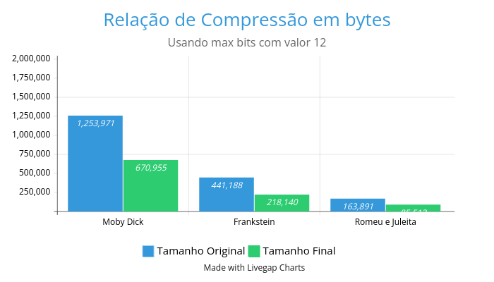
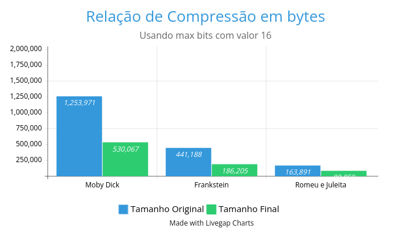
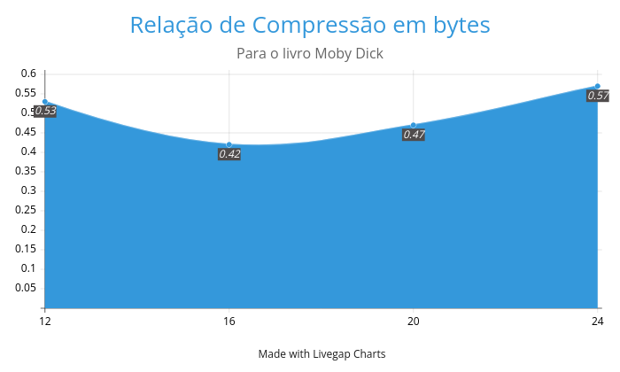
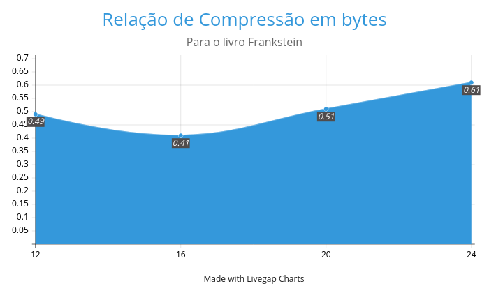
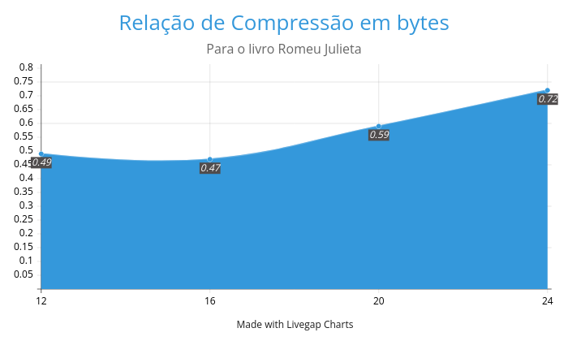
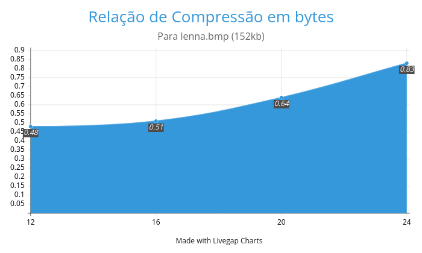
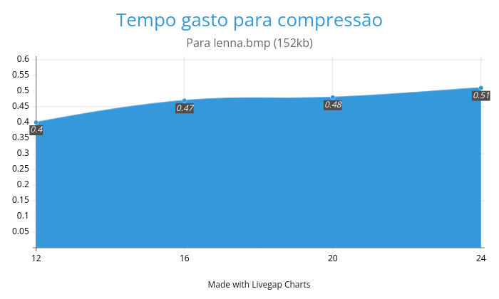
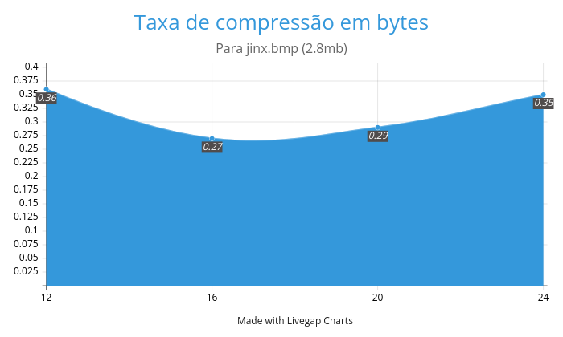
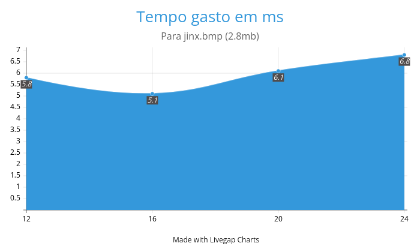

# Implementação e Análise do Algoritmo LZW de Compressão de Dados

Desenvolvido por Jalmir de Jesus Ferreira da Silva Junior  

## Sumário
1. [Introdução](#introdução)
2. [Fundamentação Teórica](#fundamentação-teórica)
3. [Implementação](#implementação)
4. [Estruturas de Dados](#estruturas-de-dados)
5. [Análise de Resultados](#análise-de-resultados)
6. [Conclusões](#conclusões)

## Introdução

O algoritmo Lempel-Ziv-Welch (LZW) é um método de compressão de dados sem perdas que foi proposto por Terry Welch em 1984 como uma implementação melhorada do algoritmo LZ78. Este algoritmo é amplamente utilizado em diversos formatos de arquivo, sendo o formato GIF um dos exemplos mais conhecidos. 

Neste relatório, apresentamos uma implementação do LZW em Python, com suporte tanto para codificação com tamanho fixo quanto variável de bits, além de uma análise detalhada de seu desempenho com diferentes tipos de dados.

## Fundamentação Teórica

### Princípio de Funcionamento

O LZW baseia-se no princípio de substituição de sequências repetidas de caracteres por códigos únicos. O algoritmo mantém um dicionário de sequências encontradas, que é inicializado com todos os caracteres possíveis (tipicamente os 256 caracteres ASCII).

O processo de compressão segue os seguintes passos:
1. Inicialização do dicionário com caracteres básicos
2. Leitura sequencial do arquivo de entrada
3. Busca da maior sequência já presente no dicionário
4. Emissão do código correspondente
5. Adição de novas sequências ao dicionário

### Variações Implementadas

Nossa implementação suporta duas variantes principais:

1. **Codificação com Tamanho Fixo**: 
   - Utiliza um número fixo de bits para todos os códigos
   - Limita o tamanho máximo do dicionário
   - Mais simples de implementar

2. **Codificação com Tamanho Variável**:
   - Inicia com 9 bits e aumenta conforme necessário
   - Melhor aproveitamento do espaço
   - Mais complexa de implementar

## Implementação

### Estrutura do Código

Nossa implementação é organizada em classes principais:

```python
class LZWCompressor:
    def __init__(self, max_bits=12, variable_size=False):
        self.max_bits = max_bits
        self.variable_size = variable_size
        # ...

    def compress(self, input_file, output_file):
        # Implementação da compressão

    def decompress(self, input_file, output_file):
        # Implementação da descompressão
```

## Estruturas de Dados

### Dicionário

Para o dicionário do algoritmo, implementamos uma arvore Trie de prefixo com as operações de insert, find e delete:

1. **Árvore de Prefixos (Trie)**:
```python
class Trie:
    def __init__(self):
        self.children = {}
        self.code = None
        self.is_end = False
```

Cada sufixo da arvore Trie é armazenado em um Map<string, Node> onde o valor da chave é o prefixo do padrão.

Dessa forma, podemos ter uma consulta eficiente para nosso algoritmo. Executando operações de inserção e procura no dicionario de padrões de forma mais rapida.

Sobre os custos

- Temos um custo de O(n) para inserir uma nova chave, onde n é o tamanho da chave.

- Temos um custo de O(n) para procurar uma nova chave, onde n é o tamanho da chave.

## Análise de Resultados

### Testes com arquivos de texto
Vamos realizar um teste de compressão sobre um dos 3 livros de dominio publico mais famosos. Eles são: Moby Dick, Frankstein, Romeu e Julieta. Cada livro possui um tamanho diferente possibilitando uma analise mais rica.

Primeiramente vamos analisar o resultado de compressão total de cada livro utilizando diferente max bits.





Podemos concluir que o algoritmo possui uma eficiencia para diferentes tamanhos de arquivos textos. Com uma taxa de compressão entre 50% do valor original.

Vamos agora analizar o impacto que o max bits tem sobre a taxa de compressão de um livro. A taxa representa quanto % o arquivo comprimido ficou em relação ao original, ou seja, quanto menor melhor.





Dessa forma, percebemos que para max bits de valor 16 temos uma melhor taxa de compressão para os arquivos. Entretanto, a partir de 24 podemos notar uma grande perca dessa taxa, principalmente em arquivos menores.

### Testes com imagens
Agora irelis realizar testes sobre um conjunto de imagens em formato bitmap. Cada imagem possui um tamanho diferente variando entre 225x225
e 1280x720.

Vamos analisar a primeira imagem de tamanho 152kb e dimensões 255x255


A primeira coisa que iremos analisar sera a taxa de compressão por max bits



Podemos observar que para um max-bit de 12 tivemos o melhor resultado de compressão. Indicando que para imagens menores vale a pena manter um dicionario menor.

Vamos também analisar o tempo gasto em ms.



Novamente para uma taxa de compressão usando max bit de valor 12 temos um menor tempo para execução.

Vamos agora analisar a segunda imagem de tamanho 2.8mb e dimensões 1280x720


A primeira coisa que iremos analisar sera a taxa de compressão por max bits



A primeira coisa que podemos notar é que obtivemos uma taxa muito eficiente de compressão para essa imagem, obtendo um arquivo comprimido com 27% do tamanho original para o max-bit 16.

Vamos também analisar o tempo gasto em ms.



Apesar de muito eficiente, podemos notar que já temos um tempo de execução bem maior para imagems relativamente grandes. 


### Exemplos Práticos

#### Exemplo de Compressão de Texto
```bash
$ python main.py compress example.txt compressed.lzw --bits 12
```

#### Exemplo com Imagem BMP
```bash
$ python main.py compress image.bmp compressed.lzw --bits 14 --variable
```

## Conclusões

### Pontos Positivos
1. Implementação eficiente para textos e imagens
2. Bom desempenho com dados repetitivos
3. Flexibilidade entre tamanho fixo e variável

### Limitações
1. Desempenho insatisfatório com imagens RGB
2. Overhead de memória com dicionários grandes
3. Necessidade de ajuste de parâmetros

A maior limitação dessa implementação foi com casos de imagens BMP com grande variação de cores. A taxa de compressão resultava em um arquivo maior que o original. Provavelmente isso ocorre pela forma como tratamos os bytes do arquivo original.